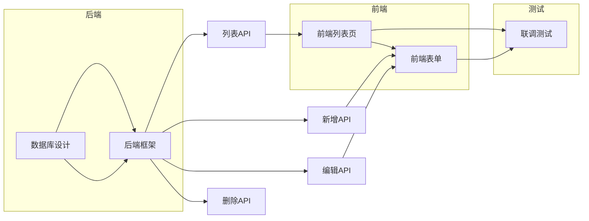

# $split - 任务拆解指令

## 触发条件
用户输入 `$split`

## 前置条件
已确认的需求文档（由 `$need` 生成）

## 执行流程

### 第1步：分析需求

输出：

```
正在分析已确认的需求文档：「[需求名称]」

需求概要：
- 功能数量：[N]个
- 涉及数据表：[N]张
- 预估工作量：[N]小时

正在评估复杂度...
```

根据需求复杂度判断：
- **简单**（< 5个任务）：数据库设计 + 后端 + 前端 + 测试
- **中等**（5-10个任务）：拆分为多个子任务
- **复杂**（> 10个任务）：拆分为多个里程碑


### 第2步：生成任务拆解清单

基于 `$need.md` 生成的需求文档，参考模板 `../templates/task-breakdown.md` 拆分为具体任务。

### 第3步：输出任务依赖关系图

```
### 任务依赖关系图


```

### 第4步：输出总结

```
---

📊 任务拆解完成！

- 总任务数：[N]个
- 总预估时间：[N]h
- 里程碑数：[N]个

⏱️ 建议节奏：
- 每次开发1-2个任务
- 完成一个里程碑后进行自测
```


### 第5步：等待确认

```
---

请确认任务清单：
- 输入 `确认` - 锁定任务清单，开始执行
- 输入 `修改 T01 改为 xxx` - 修改指定任务
- 输入 `拆分 T03` - 拆分任务
- 输入 `合并 T04 和 T05` - 合并任务
```

### 第6步：确认后锁定

用户确认后：

```
✅ 任务清单已锁定！

下一步：
- 输入 `$new` 开始执行任务
- 输入 `$status` 查看项目状态
```

## 注意事项

1. **任务粒度**：每个任务控制在 0.5-2h，不宜过长或过短
2. **依赖关系**：确保依赖链完整，无循环依赖
3. **并行识别**：可并行的任务应标注建议并行开发
4. **里程碑设置**：每 3-5 个任务设置一个里程碑，便于检查进度